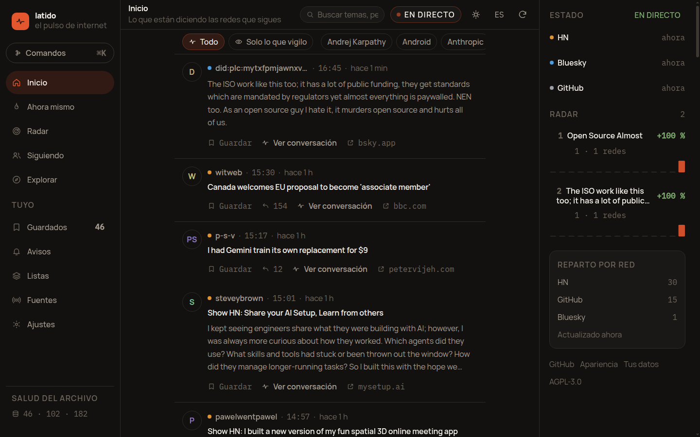
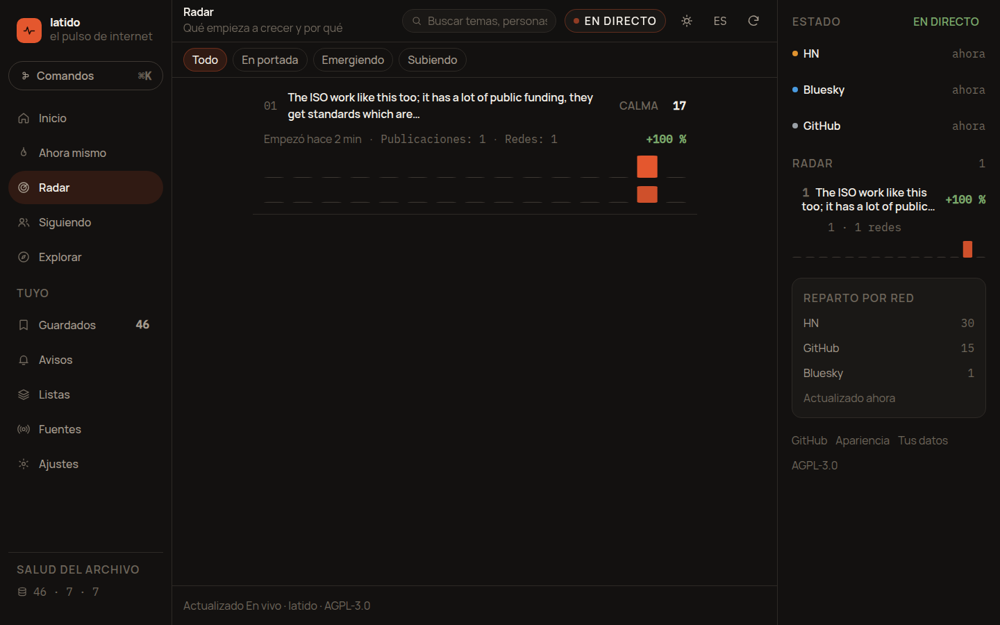
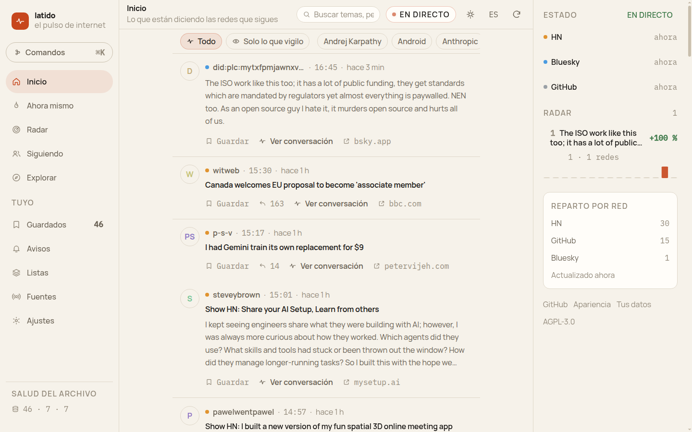

# Latido

> **El pulso de internet, en tu equipo.**
> Mira por ti las redes abiertas, agrupa lo que se está diciendo sobre lo mismo y
> te avisa **solo** cuando algo empieza a crecer.

[](https://github.com/smouj/latido/actions/workflows/ci.yml)
[](https://github.com/smouj/latido/actions/workflows/codeql.yml)
[](https://github.com/smouj/latido/releases)
[](LICENSE)
[](docs/ROADMAP.md)
[](#instalar)

---

## Qué es (y qué no es)

**No es otra red social.** No hay cuenta, no hay servidor, no hay algoritmo que
decida qué te enfada hoy. Latido lee las fuentes que tú elijas, entiende cuándo
varias de ellas hablan del mismo acontecimiento y te lo cuenta como **un tema**,
no como doscientas publicaciones sueltas.

X te enseña lo que su algoritmo quiere que veas.
**Latido te enseña qué está pasando de verdad en las fuentes que tú has decidido observar.**

**Y no se inventa nada.** No hay titulares de relleno ni historias de ejemplo: lo
que aparece en pantalla viene de Hacker News, Bluesky, GitHub, Reddit, Mastodon o
de tus propios feeds, y cada item lleva su enlace y su hora. Si una fuente falla,
se dice; si no hay nada, la pantalla lo dice en vez de rellenar el hueco.

| Pregunta | Respuesta de Latido |
| --- | --- |
| ¿Qué está pasando ahora mismo? | Cronología con los temas agrupados, no items sueltos |
| ¿Por qué empieza a hablarse de esto? | El **Trend Engine** explica el motivo con números: ×4,6 menciones, 6 redes, 1.284 publicaciones |
| ¿Y si no quiero mirar? | Reglas de aviso: "avísame si aparece en 3+ redes y crece ×3" |
| ¿Dónde están mis datos? | En tu equipo. SQLite en el escritorio, IndexedDB en el navegador. Sin cuenta |

---

## Cómo se ve

Todas las capturas están tomadas de la aplicación en marcha con **datos reales**
(Hacker News, Bluesky y GitHub), sin retocar.


*Inicio: la cronología con los temas agrupados, el estado de cada fuente y el reparto por red.*


*Radar: qué crece, cuánto y por qué — con la serie temporal, el reparto por red y el motivo en una frase.*


*Tema claro «papel»: la misma información sin la estética de terminal.*

---

## Instalar

### Desde el icono del escritorio (recomendado)

1. Descarga el instalador de tu sistema en **[Releases](https://github.com/smouj/latido/releases)**:
   `.exe` (Windows), `.deb`/`.AppImage` (Linux) o `.dmg` (macOS).
2. Instálalo y ábrelo como cualquier otra aplicación: aparece en el menú y crea su icono.

No hay cuenta, ni asistente de configuración, ni permisos raros. Al abrirlo
empieza a pedir publicaciones a Hacker News, Bluesky y GitHub.

### Linux, desde el código

```bash
./scripts/install-desktop.sh
```

Compila, instala el binario en `~/.local/bin`, los iconos en el tema del sistema y
deja un lanzador en el menú **y** un acceso directo en el escritorio. Todo en tu
perfil: no hace falta `root`. Al final imprime cómo desinstalarlo.

### Con el escritorio en desarrollo

```bash
git clone https://github.com/smouj/latido.git
cd latido
pnpm install
pnpm dev:desktop        # o: pnpm --filter @latido/desktop build
```

Necesitas **Node ≥ 20.19**, **pnpm 10** y, para el escritorio, **Rust estable**
(≥ 1.77.2). En Linux, además, las dependencias de Tauri 2:

```bash
sudo apt install libwebkit2gtk-4.1-dev libgtk-3-dev libayatana-appindicator3-dev librsvg2-dev
```

### En el navegador

```bash
pnpm install
pnpm dev                # http://127.0.0.1:5173
```

El modo navegador es la app completa, con un límite que conviene saber: algunos
sitios (Bluesky, Reddit, Mastodon, RSS) no permiten peticiones desde una página
web. El escritorio las lee con su propio cliente HTTP y no tiene ese problema. El
**flujo en directo** de Bluesky sí funciona en ambos.

---

## Fuentes

| Fuente | Estado | Necesita | Tiempo real | Notas |
| --- | --- | --- | --- | --- |
| **Hacker News** | lista | nada | sondeo (3 min) | API oficial, sin cuota declarada; también va en el navegador |
| **Bluesky / AT Protocol** | lista | nada | **Jetstream: flujo en directo** | El flujo (WebSocket) va en escritorio y navegador; la búsqueda necesita el escritorio |
| **GitHub** | lista | nada (token opcional) | sondeo (8 min) | Repos nuevos por estrellas + releases vigilados |
| **Reddit** | lista | escritorio o token | sondeo (5 min) | Respetando su `User-Agent` y sus límites |
| **Mastodon / Fediverso** | lista | escritorio | sondeo (5 min) | Etiquetas por instancia |
| **RSS / Atom** | lista | escritorio | sondeo (10 min) | Cualquier feed, incluso de un proyecto propio |
| **X (Twitter)** | **fuera de alcance** | — | — | No se automatiza fuera de su API autorizada |

Añadir una fuente es un archivo y una línea en el registro: ver
[`docs/CONNECTORS.md`](docs/CONNECTORS.md).

---

## Cómo funciona

```text
Bluesky ─┐
Reddit ──┤
HN ──────┤   ┌────────────┐   ┌───────────┐   ┌──────────────┐   ┌────────┐
Mastodon ┤──▶│ Normalizar │──▶│ Agrupar   │──▶│ Trend Engine │──▶│ Avisos │
RSS ─────┤   │  (Item)    │   │ (tema)    │   │ (velocidad)  │   │        │
GitHub ──┘   └────────────┘   └───────────┘   └──────────────┘   └────────┘
```

1. **Normalizar.** Cada red entrega lo suyo; todo se convierte en un `Item`
   canónico (con URL saneada, idioma, entidades y huella `simhash`).
2. **Agrupar.** Clustering **incremental**: cada item se une a un tema existente
   o abre uno nuevo, en tiempo constante. La señal es 40 % palabras, 25 % huella
   y 35 % entidades compartidas — por eso "OpenAI publica…" y "Nuevo modelo de
   OpenAI" caen en el mismo tema aunque no compartan casi palabras.
3. **Medir.** El Trend Engine calcula **velocidad** frente a la línea base de las
   últimas 6 h, **cobertura** (cuántas redes distintas), interacción y novedad, y
   produce un pulso de 0 a 100 con un motivo legible.
4. **Avisar.** Las reglas se evalúan contra *temas*, no contra items: "avísame si
   esto crece ×3" significa algo.

Detalle matemático completo, con los pesos reales: [`docs/TREND-ENGINE.md`](docs/TREND-ENGINE.md).

---

## Estructura

```text
latido/
├── apps/
│   ├── app/          interfaz React 19 + TypeScript (escritorio y navegador)
│   └── desktop/      shell Tauri 2: SQLite, avisos del sistema, llavero
├── packages/
│   ├── engine/       conectores, clustering y Trend Engine (TypeScript, 61 tests)
│   └── tokens/       sistema de diseño: fuente única de verdad
├── docs/             arquitectura, algoritmo, modelo de datos, privacidad
└── scripts/          verificación e iconos, sin dependencias externas
```

**Decisión clave:** el análisis está en TypeScript, no en Rust. Un solo motor,
probado con `vitest`, que corre igual dentro del WebView que en Node o en un
navegador. Rust se queda con lo que solo Rust puede hacer bien: ventana, sistema
de archivos, SQLite y llavero. Menos código duplicado, menos sitios donde fallar.

---

## Comandos

```bash
pnpm dev              # interfaz en el navegador
pnpm dev:desktop      # app de escritorio en desarrollo
pnpm test             # 63 tests del motor
pnpm typecheck        # tipos de todos los paquetes
pnpm build            # tokens → motor → interfaz
pnpm build:desktop    # instalador (.deb, .AppImage, .exe, .dmg)
pnpm verify           # verificación completa
./scripts/install-desktop.sh   # instalar en el menú y el escritorio (Linux)
./scripts/make-icons.mjs       # regenerar iconos (PNG, ICO, ICNS)
```

---

## Principios

1. **Local primero.** Sin cuenta, sin servidor, sin telemetría. Si no puedes
   abrir tus datos con `sqlite3`, no son tuyos.
2. **Nada inventado.** Ni titulares de relleno, ni ejemplos que parezcan noticias.
   Cada item se puede abrir en su origen y lleva su hora; cada número sale de una
   cuenta que puedes reproducir.
3. **Reglas, no modelos.** Descubrir tendencias es estadística barata y
   explicable. Un modelo de lenguaje es **opcional** y solo para resumir o
   traducir. Si no puedes explicar por qué un tema aparece en el Radar con una
   frase y dos números, el algoritmo está mal.
4. **Nada de automatización no autorizada.** Se usan API públicas y flujos
   oficiales (Jetstream, RSS, API de HN). X queda fuera hasta que exista acceso
   permitido: una app que depende de saltarse reglas vive hasta que la bloquean.
5. **La interfaz no miente.** Si una fuente falla, se dice cuál y por qué. Si el
   flujo en directo se cae, el indicador cambia en vez de seguir diciendo "en vivo".
6. **Interfaz con criterio, no con moda.** Grafito cálido y un único acento de
   ascua. Sin morados de IA ni degradados de cristal. Ver [`docs/DESIGN.md`](docs/DESIGN.md).

---

## Estado

Alpha usable. El motor, los seis conectores y la interfaz completa están hechos y
probados; lo que falta es pulido de escritorio (bandeja del sistema, actualizador),
más conectores y resúmenes con modelo local. Ver [`docs/ROADMAP.md`](docs/ROADMAP.md).

---

## Contribuir

Se agradecen informes de fallo, conectores nuevos y traducciones. Empieza por
[`docs/CONTRIBUTING.md`](docs/CONTRIBUTING.md); la conducta esperada está en
[`docs/CODE_OF_CONDUCT.md`](docs/CODE_OF_CONDUCT.md) y las vulnerabilidades se
reportan como explica [`docs/SECURITY.md`](docs/SECURITY.md).

## Licencia

**AGPL-3.0-or-later**. Puedes usarlo, estudiarlo, modificarlo y compartirlo; si
lo ofreces como servicio, tus usuarios tienen derecho a ver el código de lo que
les sirves. Es la misma licencia que eligió Mastodon, y por la misma razón.
